# HealthApp Redesign Plan

**Date:** 2026-10-05 · **Produced by:** three parallel design-audit agents (visual system, UX/layout, data & signature moments), synthesized.

> **Roadmap context:** the app ships today as a responsive web app (phone browser + desktop) and will **eventually be ported to a native mobile app**. This redesign is designed with that port in mind: the bottom tab bar, sheet-based pickers, 44px touch targets, and toast/dialog layer mirror native mobile patterns 1:1; the token system (colors/type/spacing as named design tokens) and self-contained components translate directly to React Native or Capacitor later. Decisions that would fight a native port (hover-dependent UI, desktop-first layouts) are avoided throughout.
**Verdict in one line:** the app is functionally complete but wears the stock Tailwind dark theme, websites-on-a-phone navigation, and developer-placeholder interactions — all three are fixable without new heavy dependencies.

---

## 1. Why it reads as "alpha" — consolidated diagnosis

The three audits independently converged on the same core problems:

1. **Stock Tailwind palette.** `bg/surface/border` are slate-900/800/700 verbatim with cyan-400 accents — the default look of every Tailwind tutorial since 2021. The navy cast is the single loudest generic signal.
2. **No typeface, no type scale.** The app renders in Segoe UI; the biggest number anywhere is 24px. An app whose content is *numbers* (weights, reps, calories, timers) sets them small, proportional, and misaligned.
3. **Desktop-website navigation on a phone product.** Top navbar → hamburger → section → second tab row. Two rows of nav chrome before content; the gym flow starts three taps deep.
4. **Native browser dialogs & zero feedback.** `window.confirm/alert/prompt` at 8+ call sites, no toasts, no undo, "Loading…" text everywhere, bare `✓ ✕` text glyphs instead of icons.
5. **The most-used components are the least designed.** The set row has 28px tap targets and an invisible completed state; the rest timer is a plain text countdown and a native `<select>`; finishing a workout — the emotional peak — is a browser confirm box.
6. **One flat surface level.** Cards are borderless slightly-lighter rectangles; inputs are the same color as the cards they sit in. Cyan means brand, water, calories, links, and charts simultaneously.

## 2. Current state (screenshots)

| Page | Screenshot | 2-line critique |
|---|---|---|
| Dashboard | 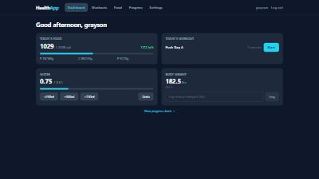 | Four identical small cards floating in empty navy; the headline number (calories left) is `text-sm`; "View progress charts" is a limp footer link. |
| Live session | 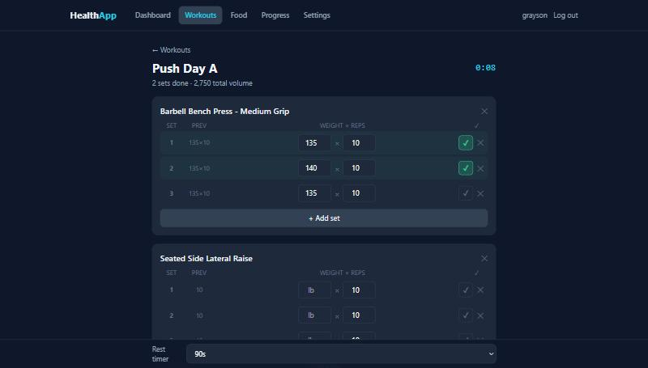 | The core screen reads as a spreadsheet: tiny timer, muted volume counter, 28px checkboxes, text-glyph deletes, rest timer = debug readout. |
| Session (close-up) | 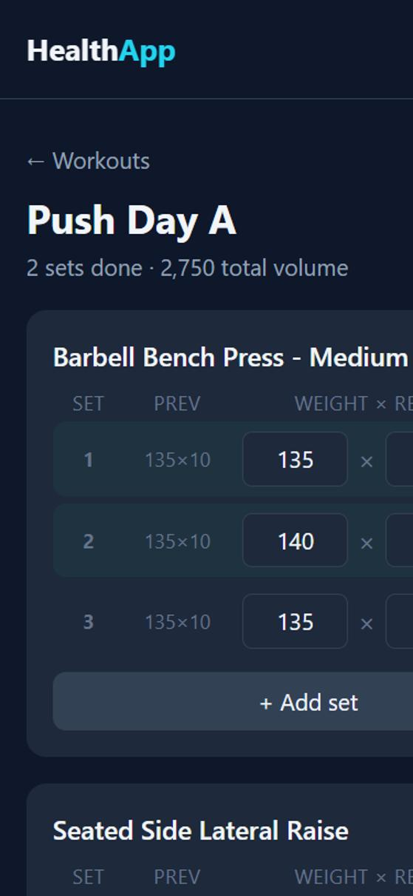 | Component detail: inputs same color as card, prev-hints same weight as live data, completed state nearly invisible. |
| Exercise library | 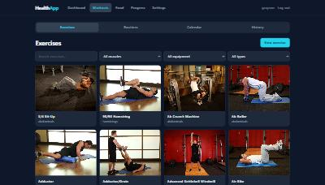 | Bright stock-photo wall on white cards against dark chrome; four stacked filter controls; Previous/Next pagination. |
| Exercise detail | 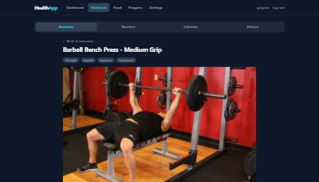 | Full-bleed bright photo pushes everything below the fold; personal stats buried at the bottom. |
| Routines | 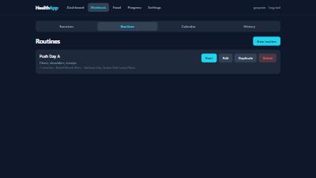 | Four equal buttons per card (permanently visible red Delete); one card floating in a void. |
| Calendar | 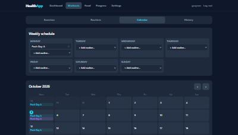 | Weekly board + month grid duplicate each other; native `<select>` masquerading as an add-button; month grid unreadable at 375px. |
| History | 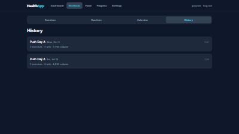 | Interchangeable two-line database rows; unitless "volume"; no way to spot a big day or PR. |
| Food log | 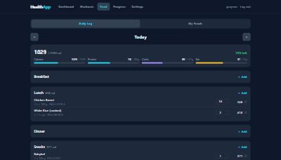 | Calories stated twice, weakly; protein bar same cyan as calorie bar; inline add-panel nests scrollbars inside the page scroll. |
| Progress | 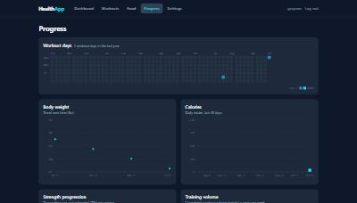 | Charts structurally sound but mute: no area fills, flat bars, "No data yet." × 5 on fresh installs, heatmap lands scrolled to 12 months ago. |
| Settings | 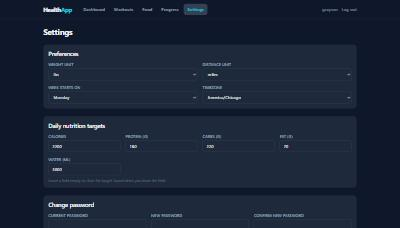 | Blur-to-save with zero confirmation; admin password reset is a `window.prompt`. |

## 3. Direction: **"Night Gym Instrument"**

A training computer, not a website. The instrument-panel language of sports hardware (cycling head units, dive watches): true near-black graphite ground, surfaces defined by hairline borders + a top catch-light instead of shadows, numerals set huge in a tabular mono face, and a strictly rationed accent system where **color = domain**:

| Token | Hex | Owns |
|---|---|---|
| `bg / surface / raised / border` | `#0B0C0E / #141518 / #1C1E22 / #26282E` | Neutral graphite ground (kills the navy; OLED-friendly) |
| `volt` | `#C8F04B` | **Workout**: brand mark, primary buttons, live-session pulse, set completion, workout charts |
| `food` | `#F5A623` (+ gold/bronze for carbs/fat) | **Food**: calorie ring, macro bars, food CTAs |
| `water` | `#4CC3F7` | **Water** only |
| `body` | `#C792EA` | **Weight & measurements** |
| `danger` | `#F26D6D` | Destructive + over-target |

**Type:** Archivo (variable) for all UI text — athletic grotesque, big x-height; **JetBrains Mono (variable) for every data numeral** — tabular, so set rows and totals align and don't wiggle when ticking. Scale: 56px timer tier → 40px dashboard heroes → 24px set values → 15px body → 12px labels. Units always small + muted next to the number, never size-peers. Two self-hosted font files total.

**Material rules:** cards `rounded-2xl` + 1px border + inset top highlight; inputs *sunken* (`raised` bg); radius locked (16 cards / 10 controls / full pills); no glows except the live-session pulse; no glassmorphism. Icons via **@phosphor-icons/react** (tree-shakeable), retiring every `✓ ✕ ← ·` glyph.

> **Decision 1 (yours):** volt-lime `#C8F04B` as the new brand/workout accent, or keep the current cyan as brand and use lime only for set-completion? The plan assumes volt; swapping is a one-token change.

## 4. Structure & interaction layer

- **Mobile: bottom tab bar** (Home · Workout · Food · Progress · Settings), 56px + safe-area, icons + labels, replacing the hamburger entirely. Slim top bar keeps page title + live-session pill. Hidden during an active session (the rest-timer bar owns the bottom edge). Desktop keeps the top navbar with volt underline for active.
- **Workouts tabs become: Train (new default) · History · Plan.** Train = today's schedule + routines with one big Start. The 873-exercise library leaves the tab row (reachable from Train + pickers) — it's reference, not a destination. `/workouts` stops redirecting to the library.
- **Toast system + ConfirmDialog** (one `useToast()`, one promise-based `useConfirm()`) replacing all `window.confirm/alert/prompt`; deletes get Undo toasts; settings blur-saves get "Saved".
- **Skeleton loaders** shaped like their content replace every "Loading…" string.
- **Top micro-interactions:** set-complete flash + `navigator.vibrate(50)` + auto rest-start; rest-timer ring draining with final-seconds color shift; add-food toast with the meal subtotal ticking up.

## 5. Signature moments (ranked)

1. **Finish-workout summary** — full-screen takeover replacing `window.confirm`: duration / volume / sets as hero stats with deltas vs. the last run of that routine, PR rows highlighted ("140×10 — new heaviest set"), tiny hand-rolled confetti only when a PR lands. Server already computes PRs.
2. **Calorie ring** — one SVG component at two sizes (Dashboard, Food Log header). Center number = *calories left* (the decision-driving number). Over target: overage arc + "143 over" in danger ink. Macros stay bars — one ring, earned.
3. **Rest timer ring** — 56px depleting ring in the bottom bar, mono countdown, amber→red under 10s, `+30s` and Skip buttons, end-timestamp persisted so navigation/lock can't kill it.
4. **Week strip + streak on Dashboard** — seven day-dots (M–S) + "3 this week · 5-week streak", derived from the existing workout-days endpoint; the heatmap's dashboard-sized ambassador.
5. **Weekly summary card** — replaces the "View progress charts →" link: workouts / volume / avg-calories vs last week with mini sparkbars; the whole card links to Progress.

## 6. Page-by-page highlights

- **Live session:** 56px set rows, 44px volt check button, mono 17px inputs, visible completed state, swipe/overflow delete (not a bare ✕), Finish in the sticky bottom bar, Delete demoted to a ⋯ menu, completed exercises auto-collapse to one-line summaries, "2/6 exercises" progress bar under the title.
- **Food log:** add-food becomes a **bottom sheet** (search pinned top, Recent → Your foods → "Search Open Food Facts" sections, Scan beside the search field); sticky date header with inline total; totals card condensed to calorie ring + one macro line; servings steppers (− 1 +) at 40px; copy-yesterday moves into the empty-day state.
- **Dashboard:** workout card becomes the hero (full-width, 48px Start), order workout → food → water → weight, week strip + weekly summary added, water Undo becomes a toast.
- **Exercise library:** search + single Filters button (sheet) on mobile, Load-more instead of pagination, names set on a dark gradient over the photos.
- **Exercise detail:** capped hero image; *your* history + PRs above instructions; PR values in ink with dates shown ("trophies need a when").
- **Routines:** Start as the only visible button, Edit/Duplicate/Delete in ⋯, body tappable, muscle-group chips.
- **Calendar:** weekly board is the phone-first editor; month grid becomes `lg:`-only; agenda list on mobile; done-vs-scheduled differentiated; routine-picker sheet replaces the select-as-button.
- **History:** month group headers, Load-more, PR badge + exercise names per card, volume with units.
- **Settings:** section grouping, Saved toasts, inline admin reset form, Log out row (mobile).

## 7. Charts & numbers

- Area-gradient fills under trend lines; per-bar target-aware coloring (today's bar full-strength); reference-line labels as pills; proper `YAxis width` with `7.8k` abbreviations; shared tooltip + legend components; `dot=false` on dense series.
- **Empty states get ghost sample data** at 18% opacity + one-line CTA ("Log a weight to start this chart") — one `ChartCard` prop fixes five charts.
- **Heatmap:** intensity keyed to the user's own volume quartiles (honest Less→More), current/best streak stats in the header, today ringed, mobile scroll lands on *now*, tap popovers instead of `title=`.
- **Number rules app-wide:** three tiers (hero 32–40px / supporting / label), `tabular-nums` everywhere, units as ink, deltas with semantic arrows + ink digits, numbers never wear series colors, rounding contract (calories int + separators, volume "7,750 lb", weight 1dp, durations "1h 12m"), *remaining* leads wherever a budget exists.

## 8. Phased implementation

| Phase | Scope | Est. |
|---|---|---|
| **R1 — Foundation** | New `@theme` tokens + Archivo/JetBrains Mono (self-hosted) + restyled `ui.tsx` primitives (Card/Button/Input/Select) + hero-number type pass + Phosphor icons installed | ~1 day |
| **R2 — Structure** | Bottom tab bar + underline tabs + Train-tab restructure + toast/confirm layer replacing all native dialogs + skeletons | ~1–1.5 days |
| **R3 — Core screens** | Set-row rebuild + rest-timer ring + finish-workout summary; food-log bottom sheet + calorie ring; dashboard reorder + week strip + weekly card | ~2–2.5 days |
| **R4 — Polish** | Chart spec + heatmap upgrades + library/detail/routines/calendar/history/settings page changes | ~1.5 days |

Each phase ships independently (app stays fully usable between phases), gets verified in-browser both viewports, and deploys through the normal CI → GHCR → container path.

> **Decision 2 (yours):** phase order. R1 alone transforms the look for the least work; R3 is where the gym experience changes. Default: R1 → R2 → R3 → R4.

---
*Constraints held throughout: plain React + Tailwind v4, Recharts stays, no component-library installs, two font files + one icon package as the only additions, dark-only, all existing functionality preserved.*
